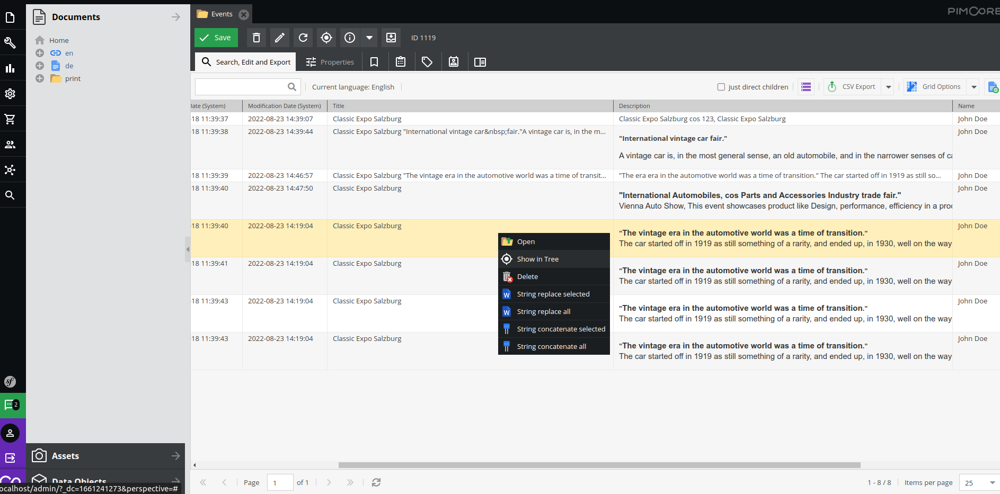

# Replace or concat strings permanently using Grid Options

It's Pimcore Bundle to replace or concat strings permanently using Grid Options. It will save replaced strings directly
in object

## Installation

```
composer require lemonmind/pimcore-save-string-replace
bin/console pimcore:bundle:enable LemonmindSaveStringReplaceBundle
```

After correct installation go to your object's folder and right click on one of the objects.
Two buttons should appear


You can also access string replacement by clicking the column arrow in the grid as below


## Usage of string replace

As mentioned above you can right-click any row in grid view to select it and bring up a context menu. <br />
If you want to include multiple rows, select them first and then right click on any of the selected ones. <br />

There are two buttons available:

- String replace selected
    - Works with filtered view
- String replace all
    - Doesn't work with filters; Overwrite the field's data for all objects

After Choosing your desired option a window should appear: <br />
 <br />
Fill in all necessary fields and click apply to save changes.

### Options details

- Select Field
    - Field to affect
    - Shows fields of type `input`, `textarea`, `wysiwyg`
    - Shows fields that are not set as `Not editable` in class definition
- Search
    - Phrase to search for
- Replace
    - Phrase that will replace all matching occurrences of search
- Insensitive
    - Allows to find matches regardless of the capitalization

## Usage of string concatenate

As mentioned above you can right-click any row in grid view to select it and bring up a context menu. <br />
If you want to include multiple rows, select them first and then right click on any of the selected ones. <br />



There are two buttons available:

- String concatenate selected
    - Works with filtered view
- String concatenate all
    - Doesn't work with filters; Overwrite the field's data for all objects

After Choosing your desired option a window should appear: <br />
 <br />
Fill in all necessary fields and click apply to save changes.

### Options details

- Select Field
    - First field to concat
    - Shows fields of type `input`, `textarea`, `wysiwyg` or `input` which means user input
    - Shows fields that are not set as `Not editable` in class definition
- Separator
    - Specifies how to separate two strings
- Select Field
    - Second field to concat
- Save to
    - Defines where to save concatenate string
