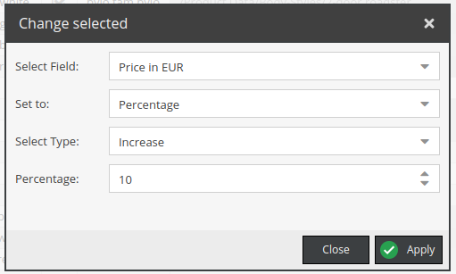

# Replace, concat strings or change number fields permanently using Grid Options

It's Pimcore Bundle to replace ,concat strings or change number fields permanently using Grid Options. It will save
replaced strings directly
in object.

It supports object bricks and classification store.

## Installation

```
composer require lemonmind/pimcore-save-string-operations
bin/console pimcore:bundle:enable LemonmindSaveStringOperationsBundle
```

After correct installation go to your object's folder and right click on one of the objects.
Two buttons should appear


You can also access string replacement by clicking the column arrow in the grid as below


## Usage of string replace

As mentioned above you can right-click any row in grid view to select it and bring up a context menu. If you want to
include multiple rows, select them first and then right click on any of the selected ones.

There are two buttons available:

- String replace selected
    - Works with filtered view
- String replace all
    - Doesn't work with filters; Overwrite the field's data for all objects

After Choosing your desired option a window should appear:


Fill in all necessary fields and click apply to save changes.

<span style="color:red">For *wysiwyg* fields, the source code is searched and replaced</span>.

### Options details

- Select Field
    - Field to affect
    - Shows the fields of type `input`, `textarea`, `wysiwyg`
    - Shows the fields that are not set as `Not editable` in class definition
- Search
    - Phrase to search for
- Replace
    - Phrase that will replace all matching occurrences of search
- Insensitive
    - Allows to find matches regardless of the capitalization

## Usage of string concatenate

As mentioned above you can right-click any row in grid view to select it and bring up a context menu. If you want to
include multiple rows, select them first and then right click on any of the selected ones.

There are two buttons available:

- String concatenate selected
    - Works with filtered view
- String concatenate all
    - Doesn't work with filters; Overwrite the field's data for all objects

After Choosing your desired option a window should appear:


Fill in all necessary fields and click apply to save changes.

### Options details

- Select Field
    - First field to concat
    - Shows the fields of type `input`, `textarea`, `wysiwyg` or `input` which means user input
    - Shows the fields that are not set as `Not editable` in class definition
- Separator
    - Specifies how to separate two strings
- Select Field
    - Second field to concat
- Save to
    - Defines where to save concatenate string

## Usage of string convert

As mentioned above you can right-click any row in grid view to select it and bring up a context menu. If you want to
include multiple rows, select them first and then right click on any of the selected ones.

There are two buttons available:

- String convert selected
    - Works with filtered view
- String convert all
    - Doesn't work with filters; Overwrite the field's data for all objects

After Choosing your desired option a window should appear:


Fill in all necessary fields and click apply to save changes.

### Options details

- Select Field
    - Field to affect
    - Shows the fields of type `input`, `textarea`, `wysiwyg`
    - Shows the fields that are not set as `Not editable` in class definition
- Capitalization
    - Type of capitalization conversion

## Usage of numeric field change

As mentioned above you can right-click any row in grid view to select it and bring up a context menu. If you want to
include multiple rows, select them first and then right click on any of the selected ones.

There are two buttons available:

- Change selected
    - Works with filtered view
- Change all
    - Doesn't work with filters; Overwrite the field's data for all objects

After Choosing your desired option a window should appear:


Fill in all necessary fields and click apply to save changes.

### Options details

- Select Field
    - Field to affect
    - Shows the fields that are not set as `Not editable` in class definition
- Set to
    - Specifies if you want to use specific value or percentage
- Value
    - Numeric value to save

If "Set to" is defined to percentage



- Select Type
    - Specifies whether you want to increase or decrease the value
